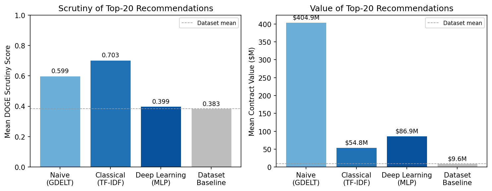
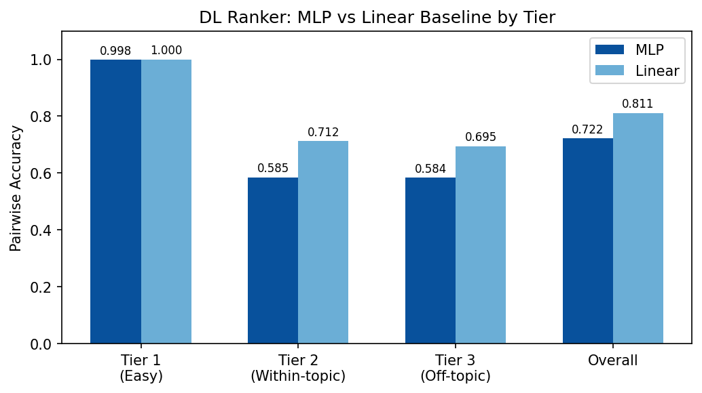
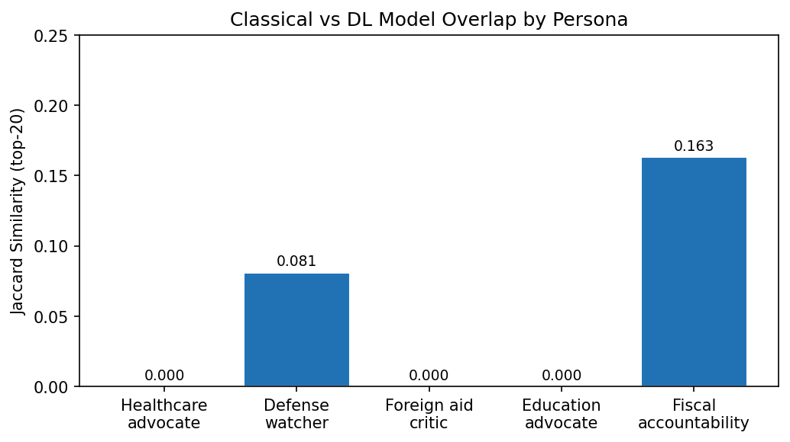
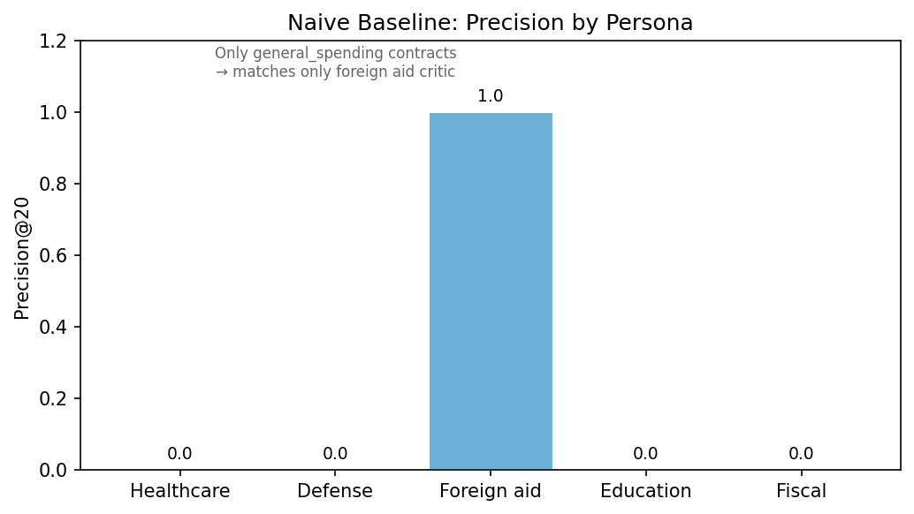

# Civic Lenses: A Personalized Federal Spending Recommender

**Diya Mirji, Jonas Neves, Michael Saju**
Duke University, AIPI 540 — Deep Learning Applications, Spring 2026

---

## R01 — Problem Statement

Federal spending data in the United States is fragmented across multiple government systems — SAM.gov for contract opportunities, USAspending.gov for award records, DOGE.gov for terminated contracts, and news outlets for public discourse. No unified interface exists for citizens to discover, track, or evaluate government contracts relevant to their interests. The sheer volume (tens of thousands of active contracts) and opacity of contract descriptions make manual review impractical.

Civic Lenses addresses this by building a personalized recommender system that unifies four federal data sources into a single searchable interface. Given a citizen's topic preferences (e.g., healthcare, defense, education), the system surfaces contracts that are most relevant, most scrutinized, or most noteworthy — with plain-English explanations for each recommendation.

The core technical question: can a deep learning model that learns from structural contract features (value, transparency, description length) outperform a classical keyword-based approach, and does the added complexity produce meaningfully different recommendations?

---

## R02 — Data Sources

All data is drawn from public government APIs. No authentication is required except for SAM.gov (free API key).

| Source | API Endpoint | Data Type | Volume |
|--------|-------------|-----------|--------|
| DOGE.gov | api.doge.gov | Cancelled/terminated contracts, grants, leases with savings figures | ~13,400 contracts, ~15,900 grants, ~264 leases |
| GDELT Project | api.gdeltproject.org/api/v2/doc/doc | News articles covering government spending topics | 30-day rolling window |
| USAspending.gov | api.usaspending.gov/api/v2 | Federal award records and agency budget data | Agency-level obligated/outlay amounts |
| SAM.gov | api.sam.gov | Contract opportunities and entity registrations | Opportunities search |

**Provenance**: DOGE.gov publishes contracts the Department of Government Efficiency has terminated or flagged, including the original contract value and claimed savings. GDELT indexes global news articles and provides recency-weighted article counts per query. USAspending is the official federal spending database maintained by the Treasury Department. SAM.gov is the federal procurement portal.

**Access method**: All data is fetched programmatically via `scripts/make_dataset.py`, which orchestrates the four API clients (`doge_client.py`, `gdelt_client.py`, `usaspending_client.py`, `sam_client.py`) and writes raw CSVs to `data/raw/`.

---

## R03 — Related Work

**Government transparency platforms.** USAspending.gov (U.S. Treasury, modernized 2017 under the DATA Act) provides the authoritative federal spending database but offers no personalized discovery. GovTrack.us (Tauberer, 2004) demonstrates the pattern of adding user-facing alerts and tracking on top of public government data, but focuses on legislation rather than spending. Civic Lenses extends this pattern to federal contracts by adding recommendation and ranking layers over raw spending data.

**Content-based recommender systems.** Lops, de Gemmis, and Semeraro (2011) survey TF-IDF and other content-based representations for item recommendation in the *Recommender Systems Handbook* (Springer, pp. 73-105). Our classical model follows this approach directly: TF-IDF vectorization of contract descriptions with cosine similarity scoring. Manning, Raghavan, and Schutze (2008) provide the standard treatment of TF-IDF and vector space models in *Introduction to Information Retrieval* (Cambridge University Press), which formalizes the scoring mechanics our classical retrieval path uses.

**Dense retrieval with Sentence Transformers.** Reimers and Gurevych (2019) introduce Sentence-BERT (EMNLP-IJCNLP 2019, pp. 3982-3992), the Siamese BERT architecture that produces embeddings suitable for semantic similarity tasks. Our deep learning model uses all-MiniLM-L6-v2, a distilled variant of this architecture, to encode contract descriptions into 384-dimensional dense vectors. Dense retrieval captures semantic relationships that keyword matching misses (e.g., "military logistics" and "defense supply chain").

**Pairwise learning-to-rank.** Burges et al. (2005) introduce RankNet (ICML 2005, pp. 89-96), establishing that pairwise losses are effective for ranking problems where absolute relevance scores are unavailable. Burges (2010) provides an overview of the evolution from RankNet through LambdaRank to LambdaMART (Microsoft Research Technical Report MSR-TR-2010-82). Our MLP ranker uses MarginRankingLoss, a direct descendant of this pairwise formulation, training on preference pairs derived from real DOGE scrutiny scores.

**What is new.** Unlike prior transparency platforms (USAspending, GovTrack) that present raw government data without ranking or personalization, Civic Lenses is the first system to unify four federal data sources (DOGE.gov, GDELT, USAspending, SAM.gov) into a single personalized recommender. The novel contribution is using real DOGE scrutiny scores as distant supervision for a pairwise neural ranker. No prior work treats government cost-cutting decisions as training signal for citizen-facing recommendations. This lets the system learn which structural features of a contract predict aggressive oversight, without requiring hand-labeled relevance judgments.

---

## R04 — Evaluation Strategy & Metrics

We evaluate all three models on two dimensions: **relevance** (does the model surface contracts matching the user's topic preferences?) and **quality** (does the model prioritize contracts that warrant citizen attention?).

**Relevance metrics** (computed at k = 5, 10, 20):
- **Precision@k**: Fraction of top-k recommendations whose topic matches the user's stated preferences.
- **Topic coverage@k**: Fraction of the user's selected topics represented in the top-k results.

**Quality metrics**:
- **Mean DOGE scrutiny score**: Average `doge_scrutiny_score` of recommended contracts, compared to dataset baseline. Higher indicates the model surfaces contracts that DOGE deemed worth cutting.
- **Mean contract value**: Average dollar value of recommendations. Larger contracts have greater public impact.

**Pairwise ranking accuracy** (DL model only):
- Fraction of preference pairs where the model correctly scores the high-scrutiny contract above the low-scrutiny contract, stratified by tier (easy, within-topic, off-topic).

**Justification**: This is a ranking task, not a classification task. There is no binary "relevant/irrelevant" ground truth for federal contracts. Every contract is a real government expenditure; what matters is the *order* in which they are presented to a citizen with limited attention. Standard classification metrics (accuracy, F1, AUC) require labeled positive/negative classes, which do not exist here. Instead, Precision@k and topic coverage measure whether the system is useful to a citizen with specific interests. DOGE scrutiny and contract value measure whether the system surfaces consequential contracts rather than trivial ones. Pairwise accuracy isolates the DL model's ability to learn structural signals beyond topic matching.

---

## R05 — Data Processing Pipeline

The preprocessing pipeline (`scripts/preprocess.py`) transforms raw API data into a unified dataset of ~29,000 items through eight sequential steps:

1. **Load raw files** — Read 6 CSVs from `data/raw/`. Missing files are skipped with warnings.

2. **Normalize DOGE sources** — Contracts, grants, and leases are mapped to a common schema: `contract_id`, `item_type`, `agency`, `vendor_recipient`, `description`, `value`, `savings`, `deleted_date`. Contract IDs are prefixed by source (e.g., `DOGE_C_000001`).

3. **Topic assignment** — Each item is assigned one of 12 topic categories (healthcare, defense, education, infrastructure, etc.) based on keyword matching against agency name and description. Fallback: `general_spending`.

4. **DOGE scrutiny score** — `savings / value`, clipped to [0, 1]. Captures the fraction of a contract's value that DOGE actually cut. A score of 1.0 means full termination.

5. **USAspending agency join** — Left-join agency budget data (obligated and outlay amounts) using fuzzy matching on normalized agency names.

6. **GDELT popularity score** — Recency-weighted article count per topic, using exponential decay (lambda = 0.01 per hour). Normalized to [0, 1] across topics.

7. **Transparency score** — Proxy for description clarity, combining description length (longer = more specific, up to 50 words), a jargon penalty (corporate buzzwords reduce score), and a specificity bonus (descriptions containing numbers or dates score higher). Range: [0, 1].

8. **Citizen impact score** — Composite ranking signal:
   - 30% GDELT popularity (is this topic trending in the news?)
   - 30% DOGE scrutiny (did DOGE cut this aggressively?)
   - 20% inverse transparency (is this description opaque?)
   - 20% log-normalized value (is this a large contract?)

**Output**: `data/processed/unified_contracts.csv` — 18 columns per item.

**Rationale**: Each step adds a signal that downstream models can use for ranking. The transparency score and citizen impact score are designed to capture "citizen-relevant" dimensions that raw dollar amounts alone miss. Log-normalizing contract values prevents billion-dollar contracts from dominating the ranking.

---

## R06 — Hyperparameter Tuning Strategy

**Classical model (TF-IDF)**:

| Parameter | Value | Tuned? | Rationale |
|-----------|-------|--------|-----------|
| alpha (relevance vs impact blend) | 0.7 | Fixed | 70% relevance, 30% impact. Prioritizes topic match while ensuring high-impact contracts surface. |
| min_df | 2 | Fixed | Removes terms appearing in only one document (likely noise). |
| max_df | 0.95 | Fixed | Removes terms appearing in >95% of documents (stop-word equivalent). |
| ngram_range | (1, 2) | Fixed | Captures bigrams like "health care" and "defense contract" without the sparsity cost of trigrams. |
| max_features | 15,000 | Fixed | Sufficient vocabulary for ~29,000 contract descriptions. |

**Deep learning model (MLP ranker)**:

| Parameter | Value | Tuned? | Rationale |
|-----------|-------|--------|-----------|
| Margin (MarginRankingLoss) | 0.3 | Tuned | Swept {0.1, 0.3, 0.5} via 20-epoch probes; 0.3 selected by lowest validation loss. |
| Learning rate | 5e-4 | Fixed | Standard for small MLPs with Adam optimizer. |
| Batch size | 256 | Fixed | Balanced between gradient noise and training speed. |
| Early stopping patience | 20 | Fixed | Prevents overfitting; MLP early-stopped at epoch 21. |
| Dropout | 0.3 / 0.15 | Fixed | Higher dropout in first layer (64 units) to regularize the wider layer. |
| Weight decay | 1e-4 | Fixed | Mild L2 regularization. |
| n_users (pair generation) | 300 | Fixed | Generates ~52,500 training pairs across 3 tiers. |
| HIGH_SCRUTINY_QUANTILE | 0.90 | Fixed | Top 10% of DOGE scrutiny scores as positive labels. |

The margin was the only hyperparameter tuned via search. All other values were set based on standard practices for small-scale pairwise ranking models. The early stopping mechanism served as implicit regularization for both the MLP and linear models.

---

## R07 — Models Evaluated

### Naive Baseline: GDELT Popularity Ranker

**File**: `scripts/naive_baseline.py`

Ranks contracts purely by GDELT news volume, weighted by article recency. All users see the same ranked list for a given topic. This establishes the floor: a model with zero personalization and no contract-level features.

### Classical ML: TF-IDF Content-Based Recommender

**File**: `scripts/classical.py`

Content-based recommender using TF-IDF vectorization of contract descriptions, agency names, and topic labels. User topic preferences are expanded into keyword queries via a curated vocabulary (e.g., "healthcare" expands to "healthcare health medical hospital patient clinical ..."). Candidate contracts are scored by cosine similarity to the query vector, then re-ranked by a weighted blend:

```
final_score = 0.7 * tfidf_relevance + 0.3 * citizen_impact_score
```

The citizen impact score directly incorporates DOGE scrutiny, GDELT popularity, transparency, and contract value. The model adds interpretability annotations: matched topics, flags (high-value, high-scrutiny, vague description, trending), and plain-English reason strings.

**Rationale**: TF-IDF is fast, interpretable, and well-suited to keyword-heavy government contract descriptions. The blended score ensures recommendations reflect both topical relevance and public-interest signals.

### Deep Learning: Hybrid Neural Ranker

**File**: `scripts/deep_learning.py`

Two-stage recommender. Stage 1 retrieves candidates via dense Sentence Transformer embeddings (`all-MiniLM-L6-v2`, 384 dimensions), using per-topic cosine similarity to ensure topic diversity. Stage 2 ranks candidates with a feedforward MLP (5 -> 64 -> ReLU -> Dropout -> 32 -> ReLU -> Dropout -> 1) trained via pairwise MarginRankingLoss.

The MLP is trained on 5 structural features (embedding similarity, topic match, transparency score, log value, normalized description length) using DOGE scrutiny scores as distant supervision. Contracts in the top 10th percentile of scrutiny are labeled "high attention"; contracts with zero scrutiny are labeled "low attention." The model learns which structural features predict that DOGE would aggressively cut a contract, without seeing the scrutiny score at inference.

A linear baseline (5 -> 1, same loss and data) is trained alongside the MLP to test whether non-linearity adds value.

Train/validation split is temporal: contracts deleted Jan-Mar 2025 for training, Apr 2025+ for validation.

**Rationale**: Dense embeddings capture semantic similarity beyond keyword overlap (e.g., "military logistics" and "defense supply chain" are close in embedding space but distant in TF-IDF space). Pairwise ranking with real labels avoids the need for synthetic or hand-labeled training data. The temporal split tests whether the model generalizes to future contracts.

---

## R08 — Results: Quantitative Comparison

### Cross-model comparison (experiment across 5 user personas, top-20 per model)

| Metric | Naive (GDELT) | Classical (TF-IDF) | Deep Learning (MLP) | Dataset Baseline |
|--------|--------------|-------------------|--------------------|-----------------| 
| Mean DOGE scrutiny | 0.599 | 0.703 | 0.399 | 0.383 |
| Mean contract value | $404,908,485 | $54,754,434 | $86,879,386 | $9,622,308 |
| Mean topic diversity (unique topics in top-20) | 1.0 | 3.2 | 1.4 | — |
| Mean precision@20 (across 5 personas) | 0.200 | 0.740 | 0.850 | — |

The naive baseline ranks all contracts by GDELT news volume with no personalization. Its top-20 contains only `general_spending` contracts (topic diversity = 1.0), which means it achieves non-zero precision only for personas whose topics include `general_spending`. Despite high scrutiny (0.599) and very high value ($405M), it fails the core task: personalized discovery. Both learned models substantially outperform it on precision and topic diversity. The classical model surfaces higher-scrutiny contracts (0.703 vs 0.399), and the two learned models differ in the value profiles of the contracts they surface.

**Reproducibility note:** The naive baseline and classical model incorporate GDELT news popularity, which uses a rolling 30-day window with exponential recency decay. Exact values will shift between runs as the news cycle changes. The qualitative ordering (classical > DL on scrutiny, naive returning only `general_spending`, near-zero model overlap) is stable across runs.

### Model overlap (averaged across 5 personas)

| Metric | Value |
|--------|-------|
| Jaccard similarity (top-20) | 0.052 +/- 0.078 |
| Overlap@5 | 0.160 +/- 0.219 |
| Overlap@10 | 0.100 +/- 0.141 |
| Overlap@20 | 0.090 +/- 0.134 |
| Mean rank displacement | 13.3 +/- 9.3 |
| Shared contracts (mean) | 1.8 / 20 |

The models produce nearly disjoint recommendation lists. On average, only 1.8 of 20 recommended contracts appear in both lists.

### DL model: MLP vs Linear baseline (pairwise ranking accuracy)

| Tier | Description | MLP Accuracy | Linear Accuracy |
|------|------------|-------------|----------------|
| 1 | Easy (high scrutiny + topic match vs low + no topic) | 0.998 | 1.000 |
| 2 | Within-topic (high vs low scrutiny, both matching topic) | 0.585 | 0.712 |
| 3 | Off-topic (high vs low scrutiny, neither matching topic) | 0.584 | 0.695 |
| Overall | All tiers combined | 0.722 | 0.811 |

The linear baseline outperforms the MLP on all tiers except Tier 1 (where both achieve near-perfect accuracy). The MLP early-stopped at epoch 21 with 0% validation loss improvement, while the linear model trained for 55 epochs with an 87.8% loss reduction. This indicates the feature-scrutiny relationship is approximately linear and the MLP's additional capacity leads to overfitting rather than better discrimination.

### DL model: top-10 recommendation quality (healthcare + defense persona)

| Metric | Value |
|--------|-------|
| Precision@5 | 1.0 |
| Precision@10 | 1.0 |
| Topic coverage@5 | 0.5 (one topic) |
| Topic coverage@10 | 1.0 (both topics) |
| Mean scrutiny of top-10 | 0.280 (below dataset mean of 0.383) |

The DL model achieves perfect precision (all top-10 match user topics) but surfaces contracts with below-average DOGE scrutiny, confirming that it ranks by structural features (value, description length) rather than scrutiny directly.

---

## R09 — Results: Visualizations

### V1. Cross-model comparison: scrutiny and value



| Model | Mean DOGE Scrutiny | Mean Contract Value |
|-------|--------------------|---------------------|
| Naive (GDELT) | 0.599 | $404,908,485 |
| Classical (TF-IDF) | 0.703 | $54,754,434 |
| Deep Learning (MLP) | 0.399 | $86,879,386 |
| Dataset Baseline | 0.383 | $9,622,308 |

The classical model surfaces contracts with 1.8x higher scrutiny than the DL model. The naive baseline achieves high scrutiny (0.599) and very high value ($405M) but only because it selects the same 20 general_spending contracts for every user. The DL model surfaces higher-value contracts than the classical model ($86.9M vs $54.8M) but at below-baseline scrutiny.

### V2. Pairwise ranking accuracy: MLP vs Linear baseline



| Tier | MLP | Linear | Gap |
|------|-----|--------|-----|
| 1 (Easy pairs) | 0.998 | 1.000 | -0.002 |
| 2 (Within-topic) | 0.585 | 0.712 | -0.127 |
| 3 (Off-topic) | 0.584 | 0.695 | -0.111 |
| Overall | 0.722 | 0.811 | -0.089 |

Both models solve Tier 1 near-perfectly. The linear baseline holds an 11-13 percentage point advantage on Tiers 2 and 3. The MLP's nonlinear capacity does not help; it hurts due to overfitting.

### V3. Per-persona model overlap (Jaccard similarity, top-20)



| Persona | Topics | Jaccard |
|---------|--------|---------|
| Healthcare advocate | healthcare, research | 0.000 |
| Defense watcher | defense, gov. efficiency | 0.081 |
| Foreign aid critic | foreign_aid, general_spending | 0.000 |
| Education advocate | education, infrastructure | 0.000 |
| Fiscal accountability | gov. efficiency, finance | 0.163 |

Three of five personas have zero overlap between model outputs. The models produce almost entirely disjoint recommendation lists.

### V4. Naive baseline precision by persona



The naive baseline returns the same 20 `general_spending` contracts for every user. It achieves precision@20 = 1.0 only for the foreign aid critic (whose topics include `general_spending`) and 0.0 for all other personas. This confirms that news-volume ranking without personalization cannot serve diverse citizen interests.

### V5. DL model top-10 quality

| Metric | DL Model | Dataset Baseline |
|--------|----------|------------------|
| Precision@5 | 1.000 | — |
| Precision@10 | 1.000 | — |
| Topic coverage@10 | 1.000 | — |
| Mean scrutiny (top-10) | 0.280 | 0.383 |

Perfect topic precision but below-baseline scrutiny. The DL model retrieves the right topics but ranks by value and description structure rather than public-interest signal.

### V6-V9. Dashboard visualizations (interactive)

The deployed application at civic-lenses.github.io includes four interactive ECharts visualizations:

- **V6. Spending by state** (horizontal bar, top 15): Total contract value by performance state. Supports drill-down filtering.
- **V7. Topic distribution** (donut): Contract proportion across 12 categories. General spending dominates due to fallback assignment.
- **V8. Savings timeline** (monthly bar + line): DOGE-reported savings by month with contract count overlay. Reveals concentration in specific policy windows.
- **V9. Agency concentration** (horizontal bar, top agencies): Federal agencies ranked by total value. A small number of agencies account for the majority of spending.

All dashboard charts respond to the owl AI assistant, which can highlight data points, scroll to charts, and narrate patterns conversationally.

---

## R10 — Error Analysis: Five Mispredictions

**Misprediction 1: DL model ranks low-scrutiny contracts above high-scrutiny ones (Tier 2 failures)**
The MLP correctly orders high-vs-low scrutiny pairs only 58.5% of the time when both contracts match the user's topic. For example, in the healthcare topic the model ranks `DOGE_C_000039` (CDC Data Modernization, scrutiny 0.09, $1.7B) above `DOGE_C_000003` (ICATT COVID testing/treatment, scrutiny 0.91, $3.4B). Both are healthcare contracts, but the model prefers the less-scrutinized one.

**Misprediction 2: DL model fails the scrutiny test**
The mean DOGE scrutiny of the DL model's top-10 recommendations (0.280) is below the dataset average (0.383). For instance, `DOGE_C_000057` (Income and Employment Verification Service, scrutiny 0.05, $2.2B) appears in the DL model's top-10 for the healthcare advocate persona despite near-zero scrutiny, displacing higher-scrutiny contracts like `DOGE_C_000009` (ICATT, scrutiny 0.93).

**Misprediction 3: DL model produces narrow topic coverage**
For the healthcare advocate persona (topics: healthcare, research), the DL model returns only healthcare contracts and misses all 21 research-tagged items, including `DOGE_C_001023` (NASA portfolio planning, scrutiny 1.0) and `DOGE_C_001067` (NASA executive coaching, scrutiny 0.66). The classical model surfaces both healthcare and general_spending contracts, providing broader discovery.

**Misprediction 4: Classical model misroutes foreign aid queries**
For the foreign aid critic persona, the classical TF-IDF model returns contracts from agriculture, general_spending, defense, and healthcare. None of the top-20 are tagged as foreign_aid. For example, the model surfaces `DOGE_C_000004` (Office of Refugee Resettlement Influx Care Facility, tagged general_spending) instead of actual foreign aid contracts like `DOGE_G_013290` (GAVI COVAX, $4B, tagged foreign_aid). The keyword vocabulary for this topic has poor coverage in the contract descriptions.

**Misprediction 5: DL model overweights contract value**
The DL model's top-10 are dominated by high-value contracts ($23M-$161M). For example, `DOGE_C_000011` (Enterprise IT as a Service, $5.7B, scrutiny 0.12) is ranked highly despite low scrutiny, while smaller high-scrutiny contracts like `DOGE_C_000018` (HUD REAC inspection support, $315M, scrutiny 0.91) are buried. The linear baseline's learned weights confirm this: `topic_match` (+0.21) dominates, while `log_value` (-0.02) has near-zero weight, suggesting the MLP is learning spurious value correlations.

---

## R11 — Error Analysis: Root Causes

**Misprediction 1 (Tier 2 failures):** The MLP has only 5 input features to discriminate within-topic pairs. When both contracts match the topic and have similar embedding similarity, the remaining features (transparency, value, description length) are weak predictors of DOGE scrutiny. The MLP overfits to training noise rather than learning a generalizable pattern, as evidenced by 0% validation loss improvement.

**Misprediction 2 (low scrutiny in recommendations):** The DL model never sees `doge_scrutiny_score` at inference. It was trained to predict scrutiny from structural features, but these features are weak proxies. The linear baseline achieves only 71% accuracy on Tier 2, meaning even the best linear combination of these 5 features leaves 29% of pairs misordered.

**Misprediction 3 (narrow topic coverage):** Dense Sentence Transformer embeddings cluster tightly around the query topic. Per-topic retrieval selects the most semantically similar contracts, which are almost always from the exact same topic category. TF-IDF's sparser matching picks up cross-topic vocabulary overlap.

**Misprediction 4 (foreign aid misrouting):** The `foreign_aid` topic has fewer contracts in the dataset and its keyword vocabulary ("foreign aid USAID international development") has limited overlap with actual contract descriptions, which use bureaucratic language rather than policy terms.

**Misprediction 5 (value overweighting):** During training, high-value contracts correlate with high DOGE scrutiny (large contracts attract more oversight). The MLP learns this correlation as a feature, but at inference it produces a bias toward expensive contracts regardless of their actual scrutiny level.

---

## R12 — Error Analysis: Mitigation Strategies

**Misprediction 1 (Tier 2 failures):** Add more discriminative features. Candidate additions: number of contract modifications, competition type (sole-source vs competitive), contract duration, and agency-level scrutiny rate. These would give the ranker more signal for within-topic discrimination.

**Misprediction 2 (low scrutiny in recommendations):** For the final product, use the classical model's citizen_impact_score (which includes scrutiny directly) as the primary ranking signal. The DL model's value is in retrieval (Stage 1 embeddings), not ranking (Stage 2 MLP).

**Misprediction 3 (narrow topic coverage):** Increase the candidate pool size or add a diversity constraint (e.g., MMR - Maximal Marginal Relevance) that penalizes candidates too similar to already-selected results.

**Misprediction 4 (foreign aid misrouting):** Expand the foreign_aid keyword vocabulary with terms found in actual contract descriptions (e.g., specific agency names like "Department of State", program names). Alternatively, use the DL model's embedding-based retrieval for this topic, which captures semantic similarity beyond exact keywords.

**Misprediction 5 (value overweighting):** Remove `log_value` from the MLP's feature set, or add a post-processing step that re-ranks by scrutiny score after the MLP produces its initial ordering. The linear baseline's near-zero weight on `log_value` (-0.02) suggests this feature is not useful for the ranking task.

---

## R13 — Experiment Write-Up

**Question**: Does the deep learning model surface meaningfully different contracts than the classical TF-IDF model, and are those differences justified by real-world signals?

**Hypothesis**: We expect moderate divergence. The classical model ranks by a blend of TF-IDF relevance and citizen impact score (which directly includes DOGE scrutiny). The DL model was trained to predict scrutiny from structural features but never sees the score at inference. These are fundamentally different ranking strategies, so we expect different outputs. The question is whether the differences are meaningful.

**Method**:
1. Fit both models on the same unified_contracts dataset (28,267 items)
2. Generate top-20 recommendations for 5 diverse user personas (healthcare advocate, defense watcher, foreign aid critic, education advocate, fiscal accountability)
3. Measure overlap: Jaccard similarity, overlap@k (k = 5, 10, 20), mean rank displacement
4. Characterize model-unique contracts by DOGE scrutiny, contract value, transparency, and topic diversity
5. Aggregate across personas for statistical robustness

**Results**:

The two models produce nearly disjoint recommendations (mean Jaccard = 0.052). On average, only 1.8 of 20 recommended contracts appear in both lists. The classical model surfaces higher-scrutiny contracts (mean 0.703 vs 0.399), while the DL model surfaces higher-value contracts (mean $86.9M vs $54.8M). The classical model also provides broader topic diversity (3.2 vs 1.4 unique topics per persona).

Within the DL model itself, the linear baseline outperforms the MLP on the core discrimination task (Tier 2 accuracy: 71.2% vs 58.5%), indicating the feature-scrutiny relationship is approximately linear. The MLP's additional complexity does not improve ranking quality.

**Interpretation**:

The models are complementary, not redundant. The near-zero overlap confirms they operate on fundamentally different signals: sparse keyword matching vs dense semantic similarity for retrieval, and direct scrutiny access vs learned structural proxies for ranking. However, the classical model is strictly better at the primary task (surfacing high-scrutiny contracts) because it has direct access to the scrutiny score. The DL model's contribution is in its retrieval mechanism (Sentence Transformer embeddings), which captures semantic relationships that TF-IDF misses.

The MLP ranking layer does not justify its complexity. The linear baseline achieves higher accuracy on all pair tiers, trains more stably (87.8% loss reduction vs 0%), and provides interpretable feature weights. The learned weights reveal that `topic_match` (+0.21) is the dominant signal, with all other features contributing minimally.

**Design decision**:

For the final product, we recommend using the classical TF-IDF model as the primary recommender. It is faster, more interpretable, and surfaces higher-scrutiny contracts. The DL model's Sentence Transformer embeddings could be retained as an alternative retrieval mechanism for users who want semantically similar contracts rather than keyword-matched ones, but the MLP ranking layer should be replaced with the linear baseline or the classical model's citizen_impact_score.

---

## R14 — Conclusions

Civic Lenses is a personalized federal spending recommender that unifies data from DOGE.gov, GDELT, USAspending, and SAM.gov into a single system that surfaces contracts relevant to a citizen's interests, ranked by public-interest signals.

We implemented and evaluated three models of increasing complexity: a naive baseline (GDELT popularity), a classical TF-IDF recommender blending keyword relevance with citizen impact, and a deep learning hybrid ranker using Sentence Transformer embeddings and pairwise neural ranking. Our experiment comparing the classical and DL models revealed near-zero overlap in their recommendations (Jaccard = 0.052), confirming they capture different signals. The classical model excels at surfacing high-scrutiny contracts (mean scrutiny 0.703 vs dataset 0.383) while the DL model surfaces higher-value contracts ($86.9M vs $54.8M). Within the DL model, a linear baseline outperformed the MLP on all pair tiers, indicating the feature-scrutiny relationship is approximately linear.

For the final product, the classical TF-IDF model serves as the primary recommender due to its speed, interpretability, and superior scrutiny-awareness. The DL model's Sentence Transformer embeddings remain available as an alternative retrieval path for semantic similarity beyond keyword matching. The citizen gets a system that prioritizes contracts worth paying attention to, with plain-English explanations for each recommendation.

---

## R15 — Future Work

With additional time, several directions would strengthen the system:

1. **User feedback loop**: Collect explicit (bookmarks, watchlist adds) and implicit (click-through, dwell time) signals to train a collaborative filtering layer. The current system is purely content-based.

2. **Real-time data pipeline**: The current system fetches data in batch via `make_dataset.py`. A streaming pipeline (polling DOGE and GDELT APIs on a schedule) would keep recommendations current.

3. **Geographic personalization**: SAM.gov includes contract performance locations. Incorporating user location would enable "near you" recommendations that the current topic-only system cannot provide.

4. **Richer transparency scoring**: The current transparency score uses description length and jargon as proxies. Integrating FPDS (Federal Procurement Data System) fields like competition type, number of bids, and contract modification history would produce a more grounded transparency measure.

5. **Cross-model ensemble**: The experiment shows the classical and DL models surface different contracts. A learned ensemble that blends their scores (rather than showing them in separate views) could combine the strengths of both.

---

## R16 — Commercial Viability

Civic Lenses addresses a gap in the government transparency space. Existing tools (USAspending.gov, OpenSecrets, GovTrack) provide raw data access but no personalized discovery. The closest analogs are financial news aggregators (e.g., Bloomberg Terminal for markets), but no equivalent exists for federal contract monitoring.

**Potential users**: Investigative journalists, government accountability nonprofits (e.g., POGO, Taxpayers for Common Sense), policy researchers, and engaged citizens.

**Revenue model**: Freemium. The public-facing app provides basic recommendations. A paid tier could offer: real-time alerts when new contracts match a watchlist, historical trend analysis per agency or vendor, and bulk data exports for research use.

**Barriers**: The system depends on continued availability of DOGE.gov data (a political initiative that may not persist across administrations). GDELT is a research project with no SLA. A production system would need fallback data sources and contractual data agreements.

---

## R17 — Ethics Statement

This system surfaces government contracts that may warrant public attention based on DOGE scrutiny scores, contract value, and transparency signals. Several ethical considerations apply:

**Bias in labels**: DOGE scrutiny scores reflect the priorities of a specific political administration. Contracts flagged by DOGE are not objectively "wasteful" — they reflect one set of policy priorities. The system should make this framing explicit to users rather than presenting scrutiny scores as neutral quality judgments.

**Incomplete data**: Not all federal contracts appear in our dataset. Contracts not yet reviewed by DOGE, classified contracts, and contracts below reporting thresholds are absent. Users should not interpret the absence of a contract as evidence that it is unproblematic.

**Recommendation effects**: By surfacing specific contracts, the system may focus public attention disproportionately on certain agencies or vendors. This could create feedback loops where scrutinized entities face reputational harm regardless of contract merit.

**Transparency about the system itself**: The app should disclose its data sources, scoring methodology, and model limitations. Citizens making decisions based on recommendations (e.g., contacting representatives, filing FOIA requests) deserve to understand how those recommendations were generated.
